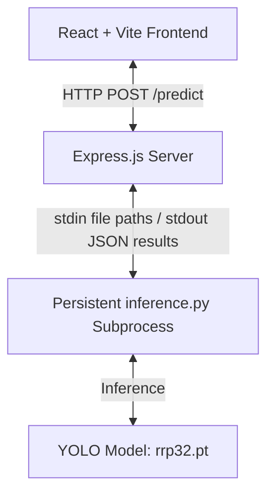

# Object Detection under Adverse Weather Conditions

A minimal, modern, and professional web application designed to run object detection (e.g., vehicles, pedestrians, traffic signs) under adverse weather conditions (fog, rain, snow, low-light) using a custom YOLO model (`rrp32.pt`).

The system uses a persistent Python subprocess architecture to execute inference on demand. By loading the model once upon server initialization, the Express.js server bypasses the model-loading overhead (1-3 seconds) on subsequent requests, yielding real-time latency.

---

### <a id="project-overview"></a>Project Overview
Adverse weather conditions like rain, fog, snow, and low light dramatically reduce the visibility of key objects in driving scenes, posing a severe challenge to standard computer vision models. This project utilizes a custom-trained **YOLO11s** model (referred to internally in the training notebook as **YOLO26s** with 260 layers and 9.4M parameters) that has been specifically fine-tuned using simulated and real adverse weather data. The accompanying application provides an intuitive user interface to upload input images, trigger inference, and visualize class-specific bounding boxes and confidence scores in real time.

### <a id="key-features"></a>Key Features
* **Persistent Subprocess Bridge**: Node.js streams image file paths through `stdin` to a running Python process and parses JSON output from `stdout`, preventing expensive PyTorch load times on request threads.
* **Calibrated Weather Augmentation**: Model trained on the **DAWN** dataset multiplied by **9.4x** through customized Albumentations transformations (rain, snow, glare, heavy fog, motion blur, night).
* **Modern Web Interface**: Intuitive frontend layout built on React, Vite, and Tailwind CSS, featuring drag-and-drop file imports, side-by-side image comparison, and interactive confidence graphs.
* **Auto-Recovery**: Automatic error detection and restart hooks for the Python daemon process in case of crashes or memory limits.

---

## <a id="table-of-contents"></a>📋 Table of Contents

- [Architecture Overview](#architecture-overview)
- [Folder Structure](#folder-structure)
- [Dataset & Model Architecture](#dataset-model-architecture)
- [Model Training](#model-training)
- [System Requirements](#system-requirements)
- [Setup Instructions](#setup-instructions)
  - [1. Model Placement](#1-model-placement)
  - [2. Python Dependencies](#2-python-dependencies)
  - [3. Backend Setup](#3-backend-setup)
  - [4. Frontend Setup](#4-frontend-setup)
- [API Documentation](#api-documentation)
- [Results & Performance](#results-performance)
- [Future Improvements](#future-improvements)
- [Troubleshooting & Support](#troubleshooting-support)

---

## <a id="architecture-overview"></a>🏗️ Architecture Overview



1. **Frontend**: React application bundled using Vite, styled with Tailwind CSS, and using Lucide icons.
2. **Backend**: Express.js server exposing REST APIs. It uses Multer for managing temporary image uploads.
3. **Inference Bridge**: The backend spawns a persistent Python process running `inference.py` when it starts up.
   - When a prediction request is received, the backend writes the temporary file path to the Python process's `stdin`.
   - The Python script (which loaded `rrp32.pt` once during startup) reads the path, runs the detection, encodes the annotated image to Base64, and prints the result as JSON on `stdout`.
   - The backend reads `stdout`, parses the JSON, deletes the temporary upload file, and returns the payload to the frontend.

---

## <a id="folder-structure"></a>📁 Folder Structure

The repository is divided into a Node/Express backend, a React frontend, and a root Jupyter notebook:

```
.
├── backend
│   ├── .env                    # Port configuration and environment variables
│   ├── .env.example            # Port configuration example template
│   ├── package.json            # Node backend dependencies
│   ├── server.js               # Entry point of the Express.js server
│   ├── python
│   │   ├── inference.py        # Persistent PyTorch YOLO wrapper loop
│   │   └── rrp32.pt            # Fine-tuned best model weights (20.3MB)
│   ├── routes
│   │   └── predict.js          # Multer configuration & predict controller
│   └── services
│       └── pythonService.js    # Child process spawn & stdin/stdout bridge manager
├── frontend
│   ├── index.html              # Main HTML frame
│   ├── package.json            # Vite frontend dependencies
│   ├── vite.config.js          # Vite server and asset compiler setup
│   ├── public
│   │   └── favicon.svg         # Custom SVG tab icon
│   └── src
│       ├── main.jsx            # React root component injector
│       ├── App.jsx             # UI container, network controllers, layout
│       ├── index.css           # Global custom classes
│       └── components
│           ├── UploadZone.jsx  # Drag-and-drop file uploader area
│           └── DetectionList.jsx # Inference metadata representation tables
└── yolo_model_training.ipynb   # Complete model pipeline training notebook
```

---

## <a id="dataset-model-architecture"></a>📊 Dataset & Model Architecture

### DAWN Dataset
The model was fine-tuned on the **DAWN (Detection in Adverse Weather Nature)** dataset. The dataset includes 1,000 real-world images representing severe weather impairments: fog, rain, snow, and sandstorms. 

### Class Remapping
The dataset classes were remapped from the Roboflow annotations (`nc=7`) to index alignments matching the **BDD100K** schema (`nc=10`) to establish transfer compatibility with pre-trained driving intelligence weights:

| Roboflow Class Index | Roboflow Name | Target BDD100K Index | Unified Name |
| :---: | :---: | :---: | :---: |
| **0** | bicycle | **5** | bicycle |
| **1** | bus | **3** | bus |
| **2** | car | **2** | car |
| **3** | motorcycle | **6** | motorcycle |
| **4** | person | **0** | pedestrian |
| **5** | train | **9** | train |
| **6** | truck | **4** | truck |
| **-** | *N/A* | **1** | rider |
| **-** | *N/A* | **7** | traffic light |
| **-** | *N/A* | **8** | traffic sign |

*Note: Classes with index 1, 7, and 8 were not natively represented in the DAWN subsets but were retained in the model architecture definition to allow general BDD100K model transferability.*

### Model Architecture
* **Version**: YOLO11s (defined in output logs as YOLO26s representing its 260-layer architecture).
* **Layer Depth**: 260 layers containing modern `C3k2` (CSP bottleneck with kernel size configuration) and `C2PSA` (self-attention mechanism) blocks.
* **Complexity**: 9,469,050 parameters (fused) and 20.5 GFLOPs.

---

## <a id="model-training"></a>🧠 Model Training

The complete training pipeline is implemented in the [yolo_model_training.ipynb](file:///c:/Users/DELL/OneDrive/Desktop/project2/yolo_model_training.ipynb) notebook.

### 1. Preprocessing & Augmentations
The original DAWN training set consisted of only **544** images. To enhance class robustness and prevent overfitting in extreme conditions, **Albumentations (v2.0.8)** was used to multiply the training data by **9.4x**, generating a final training set of **5,110** images. 

Specific weather and camera degradation parameters were configured:

* **Fog (`RandomFog`)**:
  * *Parameters*: `fog_coef_range=(0.35, 0.7)` for heavy fog, `(0.1, 0.35)` for light fog.
  * *Rationale*: Simulates light scattering, drop in contrast, and depth-dependent haze.
* **Rain (`RandomRain`)**:
  * *Parameters*: `drop_length=20`, `drop_width=1`, `brightness_coefficient=0.85`.
  * *Rationale*: Introduces falling raindrops, lens blur, and light attenuation typical of storms.
* **Snow (`RandomSnow`)**:
  * *Parameters*: `snow_point_range=(0.1, 0.4)`, `brightness_coeff=2.0`.
  * *Rationale*: Simulates snowfall occlusions and bright, reflective snow accumulation.
* **Night (`RandomBrightnessContrast` & `RandomGamma`)**:
  * *Parameters*: `brightness_limit=(-0.6, -0.3)`, `gamma_limit=(40, 80)`.
  * *Rationale*: Calibrates the model for driving in low-light and high-shadow nocturnal surroundings.
* **Blur (`MotionBlur` & `GaussianBlur`)**:
  * *Parameters*: `blur_limit=(5, 11)`.
  * *Rationale*: Replicates camera motion blur caused by engine vibrations or high vehicle speeds.
* **Glare (`RandomSunFlare`)**:
  * *Parameters*: `flare_roi=(0, 0, 1, 0.5)`.
  * *Rationale*: Simulates headlamp beams, streetlights, or direct low sun angles.
* **Occlusions (`CoarseDropout`/Random Erasing)**:
  * *Parameters*: `erasing=0.3`.
  * *Rationale*: Drop patches of the image to train the model to identify partially blocked targets.

*Bounding Box Filter*: Bounding boxes were constrained via `min_visibility=0.2`, meaning targets where less than 20% of the area remained visible after augmentation were automatically discarded.

### 2. Fine-Tuning Configuration & Hyperparameters
The model was fine-tuned on the augmented DAWN dataset with the following parameters:
* **Pretrained Weights**: `yolo26s.pt` (BDD100K transfer weights, falling back to COCO weights).
* **Hardware/Runtime**: 2 × Tesla T4 GPUs (Kaggle Environment) utilizing Distributed Data Parallel (DDP).
* **Epochs**: 50 epochs (completed in 1.060 hours).
* **Image Size (`imgsz`)**: 640 x 640 pixels (dynamically selected based on available VRAM).
* **Batch Size**: 16.
* **Optimizer**: `AdamW` (learning rate `lr0=0.0005` to prevent catastrophic forgetting of base weights, weight decay of `0.0005`, momentum of `0.937`).
* **Layer Freezing**: The first 15 layers (`freeze=15`) of the network (backbone feature extractors) were frozen. Only the detection head and deep neck layers were updated.
* **Regularization**: `patience=15` (early stopping triggers if validation mAP fails to improve for 15 straight epochs).

---

## <a id="system-requirements"></a>💻 System Requirements

Ensure you have the following installed on your machine:
- **Node.js** (v18 or higher)
- **NPM** (v9 or higher)
- **Python** (v3.8 or higher, with `pip`)

---

## <a id="setup-instructions"></a>🚀 Setup Instructions

### 1. Model Placement

Make sure the YOLO model file `rrp32.pt` is placed inside the `backend/python/` directory:
```
backend/python/rrp32.pt
```

### 2. Python Dependencies

Install the required Python packages for running YOLO and processing images:

```bash
pip install ultralytics opencv-python numpy pillow
```

### 3. Backend Setup

Open a terminal, navigate to the `backend` folder, install the Node dependencies, and start the server:

```bash
cd backend
npm install
npm start
```

> [!TIP]
> By default, the Express server runs on **http://localhost:4000**.
> To run in development mode with hot-reloading and nodemon, use: `npm run dev`.

### 4. Frontend Setup

Open another terminal window, navigate to the `frontend` folder, install the React packages, and start the Vite dev server:

```bash
cd frontend
npm install
npm run dev
```

> [!NOTE]
> The Vite dev server will run by default on **http://localhost:5173/**.

---

## <a id="api-documentation"></a>🔌 API Documentation

### **POST /api/predict**
Accepts a single image upload and returns YOLO inference results.

- **Request Type**: `multipart/form-data`
- **Body Parameter**: `image` (File, accepted extensions: `.jpg`, `.jpeg`, `.png`)
- **Success Response (200 OK)**:
  ```json
  {
    "annotated_image": "<base64_string>",
    "detections": [
      {
        "class": "car",
        "confidence": 0.92
      },
      {
        "class": "pedestrian",
        "confidence": 0.89
      }
    ]
  }
  ```
- **Error Response (400 / 500 / 503)**:
  ```json
  {
    "error": "YOLO model is still loading. Please wait a few seconds and try again."
  }
  ```

### **GET /health**
Returns the status of the Express server and checking if the background YOLO daemon is ready.

- **Success Response (200 OK)**:
  ```json
  {
    "status": "healthy",
    "pythonService": "ready",
    "uptime": 12.34
  }
  ```

---

## <a id="results-performance"></a>📈 Results & Performance

### Validation Metrics
After 50 epochs of training on the augmented adverse weather dataset, the model achieved the following performance metrics:
- **Precision**: 74.2%
- **Recall**: 67.9%
- **mAP@50**: 74.8%
- **mAP@50-95**: 49.8%

### Per-Class mAP@50 breakdown
- `rider`: 89.2%
- `pedestrian`: 81.7%
- `bicycle`: 76.4%
- `bus`: 71.9%
- `truck`: 67.2%
- `car`: 62.6%

### Speed & Throughput
Evaluated on a Tesla T4 GPU:
* **Preprocess latency**: 0.7ms per image
* **Inference latency**: 7.4ms per image
* **Postprocess latency**: 0.4ms per image
* **Total backend overhead**: < 20ms (excluding network transmission)

---

## <a id="future-improvements"></a>🔮 Future Improvements
* **Real-time Video Processing**: Implement WebSocket streaming to stream live adverse weather dashboard videos.
* **Model Pruning**: Prune redundant neural paths to compress the model weights for edge microcontrollers.
* **Model Quantization**: Quantize weights from FP32 to FP16 or INT8 to boost CPU execution speeds.

---

## <a id="troubleshooting-support"></a>🔧 Troubleshooting & Support

- **Model is loading loop**: If you see a warning that the model is still loading, wait a few seconds. The persistent Python script takes around ~4-6 seconds to compile PyTorch, OpenCV, and load the 20MB `.pt` file.
- **Port Conflict**: If port `4000` is already in use, you can configure a different port by editing `PORT` inside the [backend .env](file:///c:/Users/DELL/OneDrive/Desktop/project2/backend/.env) configuration file.
- **Python Path Problems**: If the application fails to start because it cannot find the `python` command, make sure Python is added to your environment `PATH` or define the `PYTHON_PATH` variable inside the backend environment setup.
